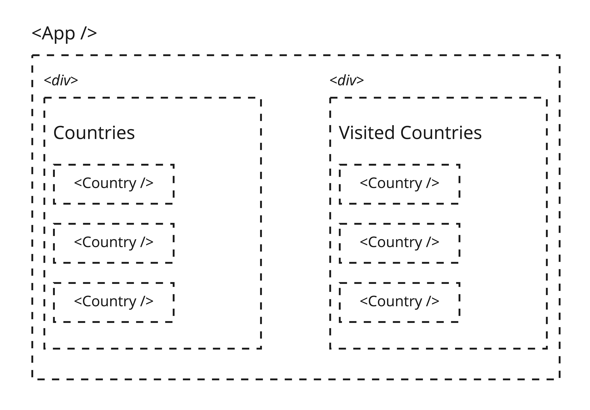
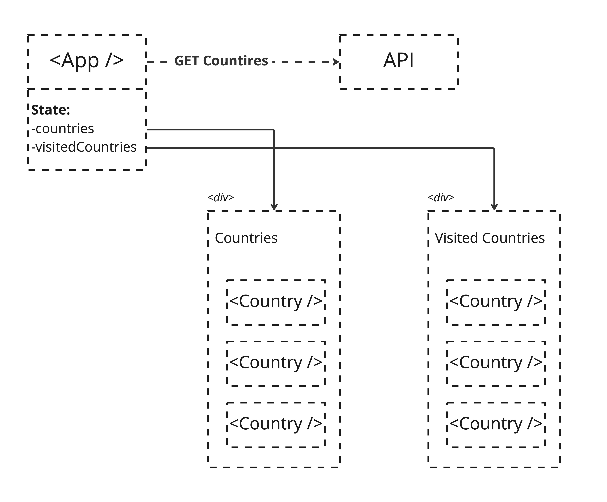

# React

## RESTCountries Exercise

This task is going to look pretty familiar. We saw the RESTCountries API previously within the JavaScript `fetch()` lab. We're going to be revisiting it here, touching on some of the same topics, but this time with our fancy new React tools under our belt.

Again, the API we are asking you to utilise is the **RESTCountries API** which returns information about a selected country including _e.g._ the name of the capital city, the local currency, its (continental) region and a link to the relevant Google Maps page.

[RESTCountries API - end-points](https://restcountries.com/#api-endpoints-v3)

## Lab Task

You will be working in pairs and will be building a **country bucket list**, combining the classic To-Do List example with novel data. The API affords great possibilities regarding visual presentation so we are leaving the specifications for the projects fairly loose. In general, each group should:

- Interface with the RESTcountries API, loading the data into your app
- Save the loaded data using React's State management system
- Present the user with a list of countries from which they can select from
- Create a means to mark a country as "visited"
- Additionally display a list of "visited countries"

`Container`
 <!--Load all the countries to be displayed as a list display on the countries component  -->
 <!-- Next to each item add a button to mark it as visited -->
<!-- If a country is marked as visited - append it to another separate list -->

<!-- functions: 
1)addCountryToVisitedList() [VisitedCountriesComponent],   
2)markCountryasVisited() [CountriesComponent & VisitedCountriesComponent]
 -->
<!-- Container:
1) fetch the data from the api and display the name of a country as a list-->

 <!-- states:
 VisitedCountries - call 1&2(2 in 1) Countries - call 2 -->

Before you jump into the code, let's think about the architecture of your frontend, and where things should be put. Firstly, let's take a look at one (possible) way to implement it. Here is a breakdown of the proposed layout:

By breaking down this layout, we can conclude that our data flow should look something like this:

Our `App.js` will be the component that fetches countries from the API, and it will be stored within the State. We can loop through the countries within app and _pass each country as a prop_ to the `Country.js` component.

> Remember: this is one possible way of going about implementing this, but if you find yourself lost in how to start you can use this as a reference!

## Extensions

There are a few extension tasks for this exercise. Note that all are extensible so we are not expecting all to be completed within the afternoon if any:

- Have a way to display more specific details of a selected country
- Implement a means to filter the countries within the initial list, akin to how we did within the original JavaScript exercise (an HTML form)
- See what properties are returned from the API which you can make use of for styling your webpage in some way

It is up to you how you design and implement this feature. Because we have left the design and largely the implementation of functionality loose for this lab, do attempt to work your way through the points set out above but also _feel free to experiment and work in other areas that you feel you need to practise with_.

## Tips

You may find that the use of a JSON formatter will help significantly when getting to grips with the data the API returns.

_e.g._ [JSON formatter - JSON Pretty Print](https://jsonformatter.org/json-pretty-print)
